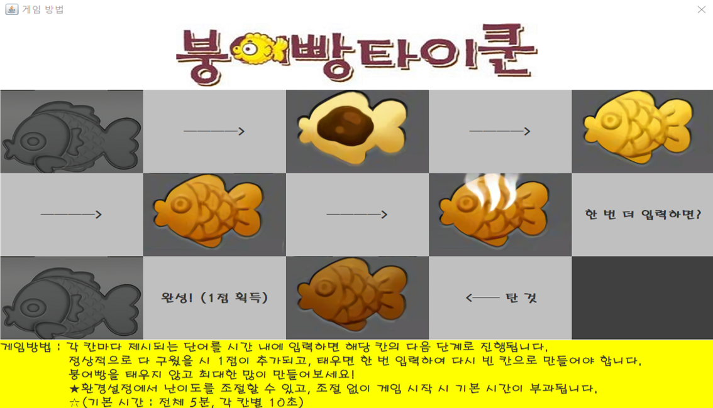
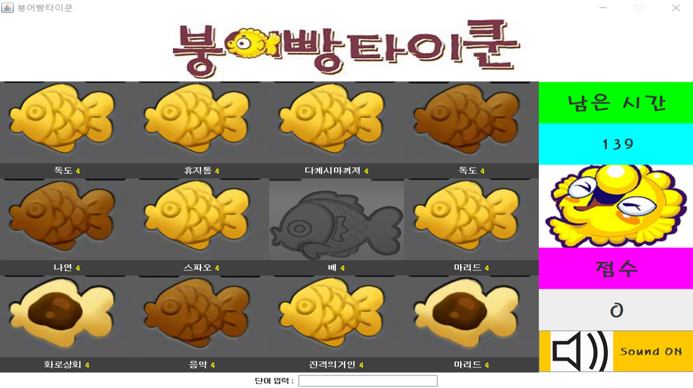
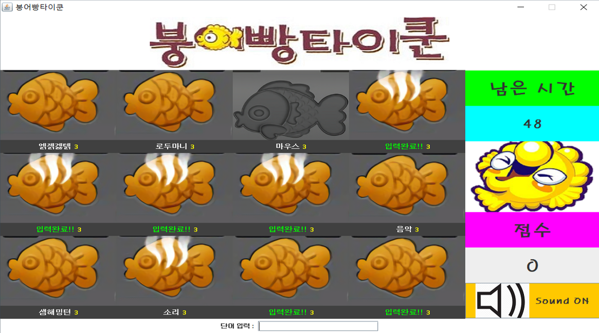

## Taiki_Cakes_Tycoon (붕어빵 타이쿤)
- 2017 2학기 JAVA 스윙 붕어빵타이쿤 프로젝트 

### 붕어빵 타이쿤 시작화면
- 게임 시작화면이며 게임방법과 게임환경설정(난이도 선택)을 해주어야 합니다.
- 배경음악이 나오며 우측하단의 붕어빵이 메뉴입니다. 마우스를 올리면 메뉴이름을 나타냅니다.   

   

### 게임방법   

   

### 게임난이도 및 시간 설정   
   

### 게임 진행화면
- 붕어빵 틀 하단에 있는 단어를 입력하면 붕어빵이 다음단계로 바뀌게 됨
- 반죽상태 / 약간익은상태 / 중간 익은상태 / 다 익은 상태(연기남) 순으로 진행되며 시간안에 단어를 입력하지 않으면 붕어빵은 타게 됨
- 탄 붕어빵은 다시 단어를 입력해야 붕어빵 틀이 비워짐
- 붕어빵이 다 구워지게 되면 점수가 올라가게 됨.   

   

   

### 게임종료
- 획득한 점수에 따라 등급이 매겨짐   
   

